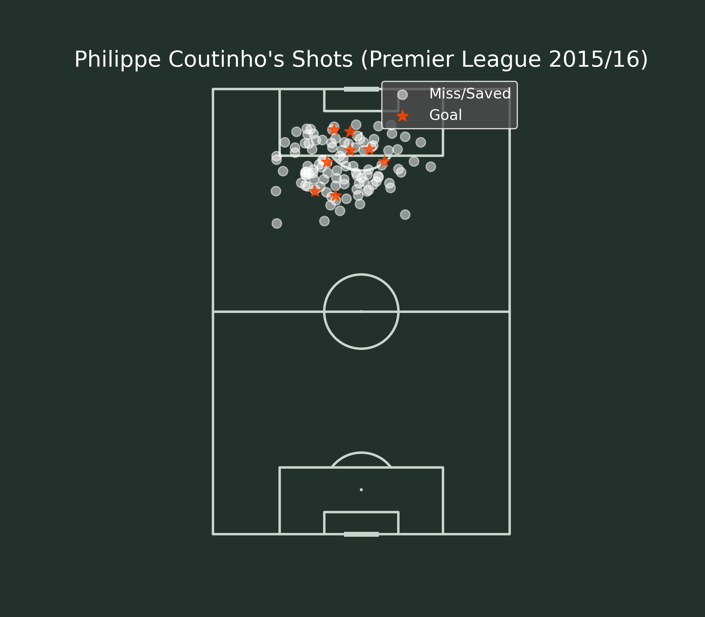

# Minghong Gao's Football Analytics Portfolio

## 📊 About Me

I am a first-year Master's student in Data Science at **UC San Diego**, driven by a deep-rooted passion for football. As a lifelong **Liverpool supporter** and an avid **Football Manager** player, I have always been fascinated by the stories hidden within the numbers of the beautiful game.

My goal is to bridge the gap between my academic training in data science and the tactical nuances of football. This repository serves as a collection of my personal projects where I apply statistical analysis, machine learning, and data visualization to uncover insights from match data. I believe that a data-informed approach is the future of football, and I am dedicated to being a part of that revolution.

## 🛠️ Technical Toolbox

* **Programming:** Python
* **Data Science Libraries:** Pandas, NumPy, Scikit-learn, Matplotlib, Seaborn
* **Football Analytics Specific:** mplsoccer, statsbombpy
* **Database:** SQL
* **Tools:** Git & GitHub, Jupyter Notebook

---

## 🚀 Projects

Here you'll find a selection of projects I've worked on. Each project includes a link to the code and a detailed analysis in a Jupyter Notebook.

### Project 1: Analysis of Philippe Coutinho's Shot Performance (2015/16 Season)



* **Description:** This project analyzes the shooting patterns of Liverpool's "Little Magician," Philippe Coutinho, during the pivotal 2015/16 Premier League season. As Jürgen Klopp's first season as manager, this analysis seeks to quantify Coutinho's role as the team's primary creative and goal-scoring threat. By visualizing all 111 of his shots and comparing his performance against the Expected Goals (xG) model, this project tells a data-driven story of his unique playing style.

* **Key Findings:**
    * **High Volume of Long Shots:** A significant majority of Coutinho's shots (**69.4%**) were taken from outside the penalty box, confirming his reputation as a player who frequently attempts long-range efforts.
    * **"Coutinho Zone":** The highest concentration of shots originates from the "left half-space," the ideal position for a right-footed player to cut inside and shoot.
    * **Above-Average Finisher:** Coutinho scored **8** goals from a total Expected Goals (xG) value of just **7.13**, resulting in an overperformance of **+0.87**. This indicates a clinical finishing ability, especially considering the low probability of his many long-range attempts.

* **Skills Used:** `Python`, `Pandas`, `Matplotlib`, `mplsoccer`, `StatsBomb API`, Data Visualization, Statistical Analysis.

* **[➡️ View Code and Full Analysis](./Coutinho_Shot_Analysis_1516.ipynb)**

#### Data Source & Acknowledgements
Data provided by StatsBomb.

<a href="https://statsbomb.com/">
  
</a>

### Project 2: [Coming Soon] Tactical Analysis via Passing Networks

* **Description:** An exploration of team playing styles by visualizing passing networks from a selected match. This project aims to identify key playmakers and common passing lanes to understand a team's tactical structure.
* **Skills Used:** `Python`, `Pandas`, `Matplotlib`, `mplsoccer`

---

## 📫 Get In Touch

I am actively seeking internship and full-time opportunities in the field of sports analytics. Let's connect and talk about football and data!

* **LinkedIn:** [www.linkedin.com/in/gaomi](www.linkedin.com/in/gaomi) 
    * **Email:** [mig064@ucsd.edu](mailto:mig064@ucsd.edu) 
    ````
